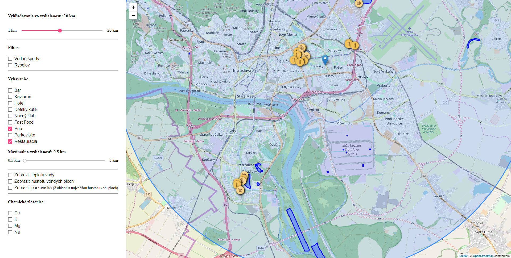

# Overview

Aplikácia umožňuje nájsť všetky vodné plochy na Slovenskus možnosťou:
- filtrovania podľa rekreačných požiadaviek (vodné plochy pre lovenie rýb a vodné športy)
- nájdenie vodných plôch v zadanom rádiuse zadaného bodu
- nájdenie všetkých záujmových miest (reštaurácii, parkovísk, hotelov, fast foodov, ...) v okolí nájdených vodných plôch v stanovenom okolí
- zobrazenie hustoty vodných plôch na Slovensku
- zobrazenie heat mapy s koncentráciou chemických látok v niektorých vodných nádržiach

Ukážka aplikácie:



Aplikácia je tvorená dvomi časťami: klient a server. Klientská aplikácia je založená na frameworku [Angular 7](https://angular.io/) s využitím knžinice [Leaflet](https://leafletjs.com/) pre vykreslovanie mapy a jednotlivých dát. Serverová časť je postavená na platforme [NodeJS](https://nodejs.org/en/) s využitím Express API v kombinácii s databázou postgres a rozšírením postgis.

# Klient

Klientská časť aplikácie je realizovaná prostredníctvom frameworku Angular, ktorý umožňuje rýchli vývoj webových aplikácií. Knižnica Leaflet poskytuje vykreslovanie mapy s využitím grafiky od poskytovateľa OpenStreetMaps. Používateľ môže na mape umiestniť marker spolu s kruhom reprezentujúcim rádius, v ktorom budú vodné plochy vyhľadávané. Vodné plochy sú pre zvýraznenie vykreslované na novej vrstve vo forme polygónov. Jendotlivé záujmové miesta sú zobrazované pomocou markerov s ikonov opisujúcov typ nájdeného, záujmového miesta. Kód spojený s vykreslovaním mapy je lokalizovaný vrámci komponentu `map.component.ts`. Aplikácia filtrov je realizovaná prostredníctvom root komponentu `app.component.ts`. 

Hlavnou úlohou klinetskej časti je:
- vykreslovanie filtrov a samotnej mapy
- vyzualizácia filtrov a vykreslovanie výsledkov vyhľadávania
- vykresľovanie heat mapy pre obsah niektorých chemických látok
- vykresľovanie heat mapy pre hustotu vodných plôch na Slovensku
- vykresľovanie všetkých parkovísk v okolí 2 oblastí s najväčšou hustotou vodných plôch (pomocou zhlukovania)

# Server

Serverová časť aplikácie je implementovaná v jazyku JavaScript, ktorý je vykonávaný na platforme NodeJS. Zabezpečuje spojenie s databázou a poskytuje základne API volania pre získavanie dát klientskou aplikáciou.

## Data

Dáta pre aplikáciu pozostávajú z vyexportovaných OSM dát pre celú Slovenskú Republiku. Dáta boli importované do databázy pomocou nástroja `osm2pgsql` s využitím štandardnej schémy. Všetky query pre získavanie dát sa nachádzajú v rámci súboru `map.controller.js`, ktorý zabezpečuje logiku všetkých API volaní.

## Zoznam queries

### Query pre nájdenie vodných plôch (UC 1)
Query pre nájdenie všetkých vodných plôch s možnosťou filtrovania podľa vzdialenosti v okolí zvoleného bodu, dostupnosti vodných športov a možnosti chytania rýb. Query vráti zoznam polygonov reprezentujúcich jednotlivé jazerá.
```
SELECT pol.osm_id as id, pol.name, ST_AsGeoJSON(st_transform(pol.way, 4326)) as geo FROM planet_osm_polygon as pol WHERE pol.natural='water'
```

Doplnok query pre vyfiltrovanie podľa vzdialenosti od zvoleného bodu
```
AND ST_DWithin(ST_Transform(pol.way, 4326), ST_SetSRID(ST_MakePoint(LONGITUDE, LATITUDE),4326)::geography, RADIUS)
```

Doplnok query pre vyfiltrovanie podľa možnosti vodných športov
```
AND pol.sport IS NOT NULL
```

Doplnok query pre vyfiltrovanie podľa možnosti chytania rýb
```
AND pol.leisure = 'fishing'
```

Doplnok query pre v prípade ak nie je zvolený žiaden filter z vyššie uvedených
```
AND pol.water IS NOT NULL AND pol.water IN ('lake', 'reservoir', 'pool')
```

### Query pre nájdenie záujmových bodov v okolí vodných plôch (UC 2)

Query pre nájdenie všetkých záujmových bodov vv zadanej vzdialenosti od nájdených vodných plôch z predchádzajúcej query. Výsledkome je zoznam bodov (centroidov) nájdených záujmových bodov.
```
SELECT com.osm_id as id, com.amenity as type, com.name as name, ST_AsGeoJSON(ST_Transform(ST_Centroid(com.way), 4326)) as geo FROM 
    (SELECT * FROM planet_osm_polygon as pol WHERE pol.osm_id IN (POLYGON_IDS_ARRAY)) as tar
    CROSS JOIN
    (
        SELECT osm_id, tourism as amenity, name, way FROM planet_osm_polygon WHERE tourism IS NOT NULL AND tourism IN ('parking', 'restaurant', 'pub')
        UNION
        SELECT osm_id, amenity, name, way FROM planet_osm_point WHERE amenity IN ('parking', 'restaurant', 'pub')
    ) as com
WHERE ST_DWithin(ST_SetSRID(tar.way, 4326), ST_SetSRID(com.way, 4326), RADIUS)
```

### Query pre získanie nameraných hodnôt meracích staníc (UC 3)

Query pre získanie všetkých nameraných hodnôť pre zvolené chemické látky (alebo teploty) pre niektoré vodné plochy na Slovensku. Query získava dáta z externého datasetu mimo OSM dát.
```
SELECT sta.lakename, sta.longitude, sta.latitude, sub.determinand_supportive as substance, sub.mean as value FROM stations as sta 
JOIN substances as sub ON (sta.nationalstationid = sub.nationalstationid)
WHERE sta.countrycode = 'SK' AND sub.determinand_supportive IN ('Ca', 'Temperature')
```

### Query pre získanie centroidov všetkých vodných plôch (Extra UC)

Query pre získanie centroidov všetkých vodných plôch pre vizualizáciu hustoty vodných plôch prostredníctvom heat mapy.
```
SELECT ST_AsGeoJSON(st_transform(ST_Centroid(pol.way), 4326)) as geo, ST_Area(st_transform(pol.way, 4326)) as area FROM planet_osm_polygon as pol WHERE pol.natural='water'
```

### Query pre získanie parkovísk v oblastiach s najväčšou hustotou vodných plôch (Extra UC)

Query pre získanie všetkých parkovísk, ktoré sa nachádzajú v dvoch oblastiach s najväčšou hustotou vodných plôch. Zhlukovaním vodných plôch sú získané hluky ku ktorým sa nájde najmenší boundig box na základe ktorého sú vyfilitrované dve najväčšie oblasti.
```
SELECT par.osm_id as id, par.name, ST_AsGeoJSON(ST_Transform(par.way, 4326)) as geo FROM
    (SELECT * FROM planet_osm_point as poi WHERE poi.amenity='parking') as par
    CROSS JOIN
    (SELECT * FROM 
        (SELECT ST_MinimumBoundingCircle(unnest(ST_ClusterWithin(pol.way, 10000))) as bounding FROM planet_osm_polygon as pol WHERE pol.natural='water' AND pol.water IN ('lake', 'reservoir', 'pond')) as bou
        ORDER BY ST_Area(bou.bounding) DESC LIMIT 2
        ) as reg		
WHERE ST_Contains(reg.bounding, par.way)
```

## Optimalizácie

Pre optimalizovanie queries boli vytvorené indexy pre:
- tabuľka `planet_osm_polygon` -> stĺpce (osm_id), (amenity), (tourism), (natural, water) - pre rýchle vyhľadávanie riadkov so zodpovedajúcimi ID, amenity a kombináciou hodnôt (natural a water)
- tabuľka `planet_osm_point` -> stĺpce (amenity) - pre rýchle vyhľadávanie riadkov s požadovanou hodnotu amenity

### Query vyžadujúca optimalizáciu

```
SELECT com.osm_id as id, com.amenity as type, com.name as name, ST_AsGeoJSON(ST_Transform(ST_Centroid(com.way), 4326)) as geo FROM
  (SELECT * FROM planet_osm_polygon as pol WHERE pol.osm_id IN ('4318221','4355144','4903590','5836002')) as tar
  CROSS JOIN
  (
    SELECT osm_id, tourism as amenity, name, way FROM planet_osm_polygon WHERE tourism IS NOT NULL AND tourism IN ('restaurant','parking')
    UNION
    SELECT osm_id, amenity, name, way FROM planet_osm_point WHERE amenity IN ('restaurant','parking')
  ) as com
WHERE ST_DWithin(ST_SetSRID(tar.way, 4326), ST_SetSRID(com.way, 4326), 500)
```

Nahradením niektorých operácii ST_Transform funkciou ST_SetSRID v klauzule WHERE zredukovalo čas 3 minúty na 2,5 sekundy.
Vytvorením indexu pre tabuľku `planet_osm_polygon` na stĺpec `osm_id` a pre tabuľku `planet_osm_point` a stĺpec `amenity` bola časová zložitosť query zredukovaná z 3 sekúnd len na cca 200 msec.

## API

**Získanie polygonov všetkých jazier vo vzidalenosti 1 km od zadnaho bodu**

`POST /getLakes`

Request:
```
"filter": {
    "radius": 1000,
    "coordinates": {
        "lat": 48.10674343697761,
        "lng": 17.1137809753418
    },
    "sports": false,
    "fishing": false,
    "quality": false
}
```

Response:
```
{
    "success": true,
    "data": [
        {
            "id": "4318221",
            "name": "Veľký Draždiak",
            "geo": {
                "type": "Polygon",
                "coordinates": [
                    [
                        [
                            17.110259,
                            48.102896599913
                        ],
                        ...
                    ]
                ]
            }
        },
        ...
    ]
}

```

**Získanie všetkých reštaurácií a pubov v okolí vyššie nájdených jazier**

`POST /getFeatures`

Request:
```
{
    "filter": {
        "lakes": [
            "4318221",
            "4355144",
            "4903590",
            "5836002"
        ],
        "features": [
            "restaurant",
            "pub"
        ],
        "radius": 500
    }
}
```

Response:
```
{
    "success": true,
    "data": [
        {
            "id": "1808975019",
            "type": "pub",
            "name": null,
            "geo": {
                "type": "Point",
                "coordinates": [
                    17.1106112,
                    48.1064989999122
                ]
            }
        },
        ...
    ]
}
```

**Získanie všetkých nameraných hodnôt vápnika**

`POST /getSubstancesData`

Request:
```
{
    "filter": {
        "substances": [
            "Ca"
        ]
    }
}
```

Response:
```
{
    "success": true,
    "data": [
        {
            "measurement": "Ca",
            "coordinates": [
                19.665,
                48.5294
            ],
            "value": 10.86
        },
        {
            "measurement": "Ca",
            "coordinates": [
                17.4062,
                48.7082
            ],
            "value": 79.3333
        },
        ...
    ]
}
```

**Získanie centroidov všetkých vodných plôch na Slovensku (heatmap)**

`POST /getLakesDensity`

Response:
```
{
    "success": true,
    "data": [
       {
            "area": 3.75716514910602e-7,
            "geo": {
                "type": "Point",
                "coordinates": [
                    21.6842023320218,
                    49.4441320634549
                ]
            }
        },
        {
            "area": 2.11711199951442e-7,
            "geo": {
                "type": "Point",
                "coordinates": [
                    22.5091922628755,
                    49.055720874305
                ]
            }
        },
        ...
    ]
}
```
**Získanie všetkých parkovísk v okolí dvoch oblasti s najväčšou hustotou vodných plôch**

`POST /getFeaturesByWaterDensity`

Response:
```
{
    "success": true,
    "data": [
       {
            "geo": {
                "type": "Point",
                "coordinates": [
                    18.3076785,
                    48.2907014998675
                ]
            }
        },
        {
            "geo": {
                "type": "Point",
                "coordinates": [
                    18.3572139,
                    48.3384476998559
                ]
            }
        }
        ...
    ]
}
```

Všetky geometrie sú prestransformované do JSON formátu s využitím funkcie `ST_AsGeoJSON` 